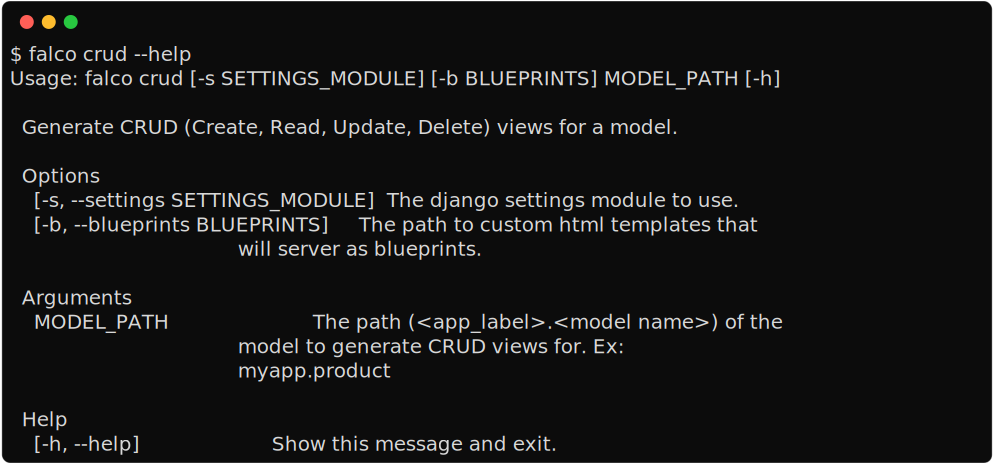

CRUD for your model
===================

This command generates htmx-powered create, read, update, and delete views for your model. It follows a similar idea as `neapolitan <https://github.com/carltongibson/neapolitan>`_
but with a completely different approach. To use **neapolitan**, you'll inherit from its base class view, and for customization, get familiar with its API (which is fairly easy).
I prefer function-based views, so this command generates basic and simple function-based views with some basic HTML templates.

.. admonition:: Why function based views?
    :class: hint dropdown

    I think class-based views get complex faster than function-based views. Both have their use cases, but function-based views
    stay simpler to manage longer in my experience. There is an excellent document on the topic, read this `django views the right way <https://spookylukey.github.io/django-views-the-right-way/>`_.

This command depends on your ``manage.py`` to work, so you must run it from your project root directory.

**Examples**

.. code:: bash

    $ falco crud products.product
    $ falco crud products
    $ falco crud products.product -e="secret_field1" -e="secret_field2"
    $ falco crud products.product --only-html
    $ falco crud products.product --only-python
    $ falco crud products.product --html-blueprints=my_folder/custom_blueprints
    $ falco crud products.product --entry-point
