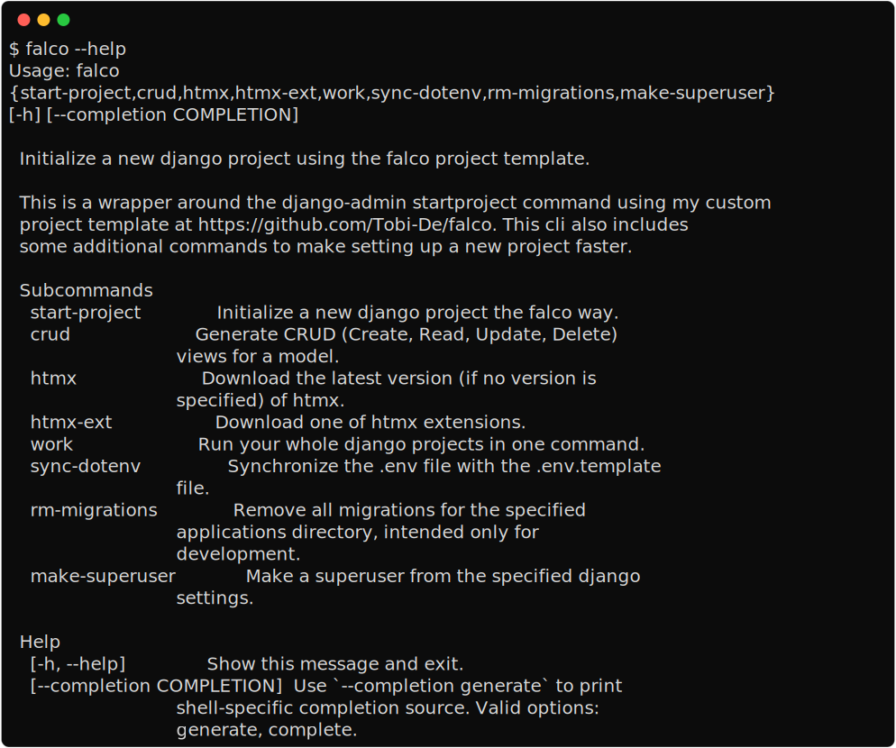

The CLI
=======

The falco CLI is included with the package installation. It provides a set of commands that I hope will be useful to you throughout the
lifecycle of your project, from project setup to deployment.

.. note::

    If you encounter any issues or unexpected behavior with the CLI, please report it on
    `GitHub <https://github.com/tobi-de/falco/discussions>`_.

The entrypoint for the CLI is the ``falco`` command. It is used to run every other subcommands.

.. important::

    Most of the commands here depends on the ``manage.py`` file, so make sur to run them on them at the root of
    your django project.

.. toctree::
   :hidden:

   start_project
   crud
   htmx
   work
   migrations
   sync_dotenv
   make_superuser
