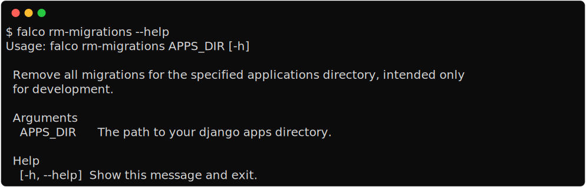

Remove all migrations
=====================

It is a good idea to delete all migrations and recreate them from scratch when deploying your Django project for the fist time.
This ensures a clean base without any remnants of testing or experimentation from the initial development phase. Even during development,
when exploring new project models, it is often necessary to delete all migrations and start over. This command is designed for these scenarios,
as it deletes all migrations in your project.
The command checks the debug value of your project using the `manage.py` file. If the debug value is set to ``False``, the command will fail.
It takes an optional argument, `apps_dir`, which specifies the directory containing your apps. If no argument is provided, it assumes that the apps
directory has the same name as the current parent directory. For example, if your project is named ``my_awesome_project``, the command will assume that
the apps directory is a subdirectory with the same name, i.e., ``my_awesome_project/my_awesome_project``. This is the default project layout created
by the `falco startproject </the_cli/start_project.html>`_ command.

**Example**

.. code:: shell

   falco rm-migrations
   # or
   falco rm-migrations my_apps_dir

.. warning::

   This command will delete all your migrations files, be sure to commit your changes before running this command.
