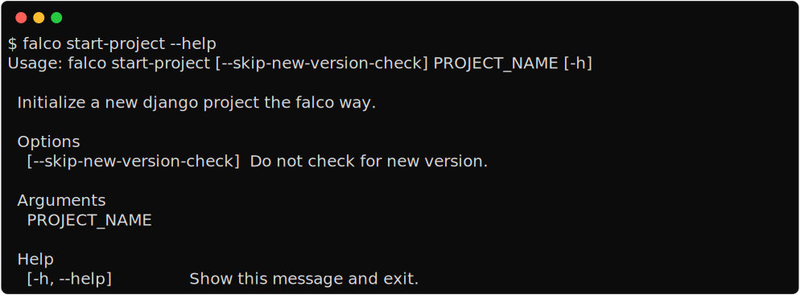

Start project
=============




Initialize a new Django project. This template makes several assumptions; we'll go through the most important choices I made below.
I'll list some alternatives below in case you don't agree with my choices. But even if you choose to use an alternative, most commands
can still be useful to you, and the `guides </guides/index.html>`__ are not particularly tied to the generated project. So, even with another template, **Falco** 
can still bring you value.


.. note::

   The **authors** key of the ``[tool.project]`` section in the ``pyproject.toml`` is set using your git global user
   configuration. If you haven't set it yet, `see this page <https://git-scm.com/book/en/v2/Getting-Started-First-Time-Git-Setup#_your_identity>`_.


Project Structure
-----------------

Now w'll go through more details about the structure, layouts and packages used for the project template and therefore available
in your generated project.


.. figure:: ../images/project-tree.svg


Login via email instead of username
-----------------------------------

I completely removed the ``username`` field from the ``User`` model and replaced it with the ``email`` field as the user unique identifier.
This ``email`` field is what I configured as the login field via `django-allauth <https://github.com/pennersr/django-allauth>`__. More often then not when I create a new django project
I need to use something other than the ``username`` field provided by django as the unique identifier of the user, and the ``username`` field
just becomes an annoyance to deal with. It is also more common nowadays for modern web and mobile applications to rely on a unique identifier
such as an email address or phone number instead of a username.
The project also includes `django-improved-user <https://django-improved-user.readthedocs.io/en/latest/index.html>`__ which replaces the common ``first_name`` and ``last_name`` used for user details with ``full_name``
and the ``short_name`` fields. If you want to know the reasoning behind this, read the `project rationale <https://django-improved-user.readthedocs.io/en/latest/rationale.html>`__.
Currently, the latest version of ``django-improved-user`` that works without problems is an alpha version (v2.0a2). This can be annoying
to deal with when updating dependencies, you can get the same result as I just described with the django-authtools package.

!!! Note “Don’t ask for what you don’t need”
Make sure you need ``first_name`` - ``last_name`` or ``short_name`` - ``full_name`` before asking your users for this information.

::

   !!! Quote "[rezaid.co.uk](https://rezaid.co.uk/app-website-gdpr-compliant/)"
       The less customer information you hold, the more your chances are of becoming [GDPR](https://gdpr-info.eu/art-5-gdpr/) compliant.
       However, this does not mean that you let go of relevant data. It is important is to always ask: Do you need it?
   If you ever decide you need them you can always request them later

If on the other hand you don’t agree with what I just wrote or for the particular project you are currently working on
my configuration doesn’t work for you, removing django-improved-user should be an easy change.

First update the ``User`` models to inherit from django ``AbstractUser`` instead of the django-improved-ser one.

.. code:: python

   # users/models.py

   from django.contrib.auth.models import AbstractUser

   class User(AbstractUser):
       pass

Then delete the ``forms.py``, ``admin.py`` and ``migrations/0001_initial.py`` files in the ``users`` app.
With that you should be good to go, if you want something a little more complete to start with you can grab some
code from the `cookiecutter-django users app <https://github.com/cookiecutter/cookiecutter-django/tree/master/%7B%7Bcookiecutter.project_slug%7D%7D/%7B%7Bcookiecutter.project_slug%7D%7D/users>`__.

DjangoFastDev
-------------

Occasionally you may see a ``FastDevVariableDoesNotExist`` error, this exception is thrown during template rendering
by `django-fastdev <https://github.com/boxed/django-fastdev>`__ when you try to access a variable that is not defined in the context
context of the view associated with that template. This is intended to help you avoid typos and small errors that will
have you scratching your head for hours, read the project `readme <https://github.com/boxed/django-fastdev#django-fastdev>`__ if you want more reasons
to why it make sense to use it. But since this can be annoying for some people, you can disable it by removing ``django-fastdev``
entirely or by commenting out the *django-fastdev* application in the ``settings.py`` file.

.. code:: python

   THIRD_PARTY_APPS = [
       ...
       # 'django_fastdev',
   ]

Dependencies management
-----------------------

If you are using poetry then you probably already knows what to do, using poetry is pretty straightforward and that’s why I like it.
With poetry the simplest workflow looks something like this:

.. code:: shell

   poetry install
   poetry add package_name
   poetry remove package_name

!!! Note “Updating your dependencies”
I recommend the `poetry-plugin-up <https://github.com/MousaZeidBaker/poetry-plugin-up>`__ to easily update your dependencies.
I used to include `poetryup <https://github.com/MousaZeidBaker/poetryup>`__ in the project template, but that has been deprecated
in favor of the new `up plugin <https://github.com/MousaZeidBaker/poetryup>`__.

If on the other hand you choose to remove poetry using the ```cuzzy remove-poetry`` <https://tobi-de.github.io/falco/usage/#cuzzy-remove-poetry>`__ and additionally
created a virtualenv with the ``-c`` option, then I’ve added a few things that might be useful to you.

The ``pyproject.toml`` file
~~~~~~~~~~~~~~~~~~~~~~~~~~~

When I first started using poetry I thought this file was a poetry specific thing, but it turns out that it is not. The ``pyproject.toml`` file is a
python standard introduced to unify and simplify python project packaging and configurations.
The pip documentation gives much more details on this than I can cover here, so I will just link to it `here <https://pip.pypa.io/en/stable/reference/build-system/pyproject-toml/>`__.
A loot of tools in the python ecosystem support it and it seems this is what we are going to be using in the future so I’ve kept it.

Hatch
~~~~~

Installed at the same time as ``pip-tools``, `Hatch <https://hatch.pypa.io/latest/>`__ is the build system specified in the ``pyproject.toml`` file. Since you are probably
not going to package and publish your django project you don’t really need it, but ``pip-tools`` does need a build system defined
to work.

    "Hatch is a modern, extensible Python project manager."

    -- Official hatch documentation


Hatch does everything you need to manage a python project, dependencies, virtual environments, packaging, publishing, scripts, etc and it also uses
the ``pyproject.toml`` file. The one available after the ``remove-poetry`` command is a good base to start using hatch.

Just run

.. code:: shell

   hatch env create

Read the `hatch documentation <https://hatch.pypa.io/latest/>`__ for more infos.


Static and media files
----------------------


Media storage
^^^^^^^^^^^^^

Media files in django usually refer to files uploaded by users, profile pictures, product images, etc.
I usually manage my media files using `django-storages <https://github.com/jschneier/django-storages>`__.
Here is how I set it up.

.. code:: python

   # core/storages.py
   from storages.backends.s3boto3 import S3Boto3Storage

   class MediaRootS3Boto3Storage(S3Boto3Storage):
       location = "media"
       file_overwrite = False


   # settings.py - production settings
   AWS_ACCESS_KEY_ID = env("DJANGO_AWS_ACCESS_KEY_ID")
   AWS_SECRET_ACCESS_KEY = env("DJANGO_AWS_SECRET_ACCESS_KEY")
   AWS_STORAGE_BUCKET_NAME = env("DJANGO_AWS_STORAGE_BUCKET_NAME")
   DEFAULT_FILE_STORAGE = "project_name.core.storages.MediaRootS3Boto3Storage"
   MEDIA_URL = f"https://{AWS_STORAGE_BUCKET_NAME}.s3.amazonaws.com/media/"


Switch to bootstrap5
--------------------


Alternative starters
--------------------