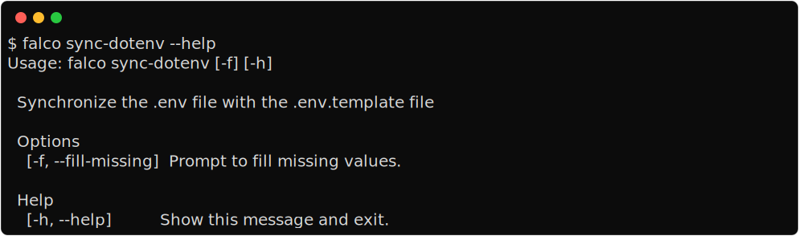

Keep the .env and .env.template in sync
=======================================

When you run the ``sync-dotenv`` command, it performs the following steps:

#. It reads the values from the ``.env.template`` file, a set of default values (see below), and the ``.env`` file, in that order. If the same key is present in multiple sources, the value from the later source is used.
#. If the ``--fill-missing`` option is provided, it will prompt you to fill in any values that are currently empty.
#. It sorts the configuration keys alphabetically.
#. It empties the ``.env`` file and writes the new configuration values to it. Each key-value pair is written on a new line, with the format ``KEY=VALUE``.
#. It empties the ``.env.template`` file and writes the new configuration keys to it. If a key was originally present in the ``.env.template`` file, its value is preserved; otherwise, the value is left empty.

**Default Values**

The command uses the following default values:

- ``DJANGO_DEBUG``: ``True``
- ``DJANGO_SECRET_KEY``: A randomly generated secure token.
- ``DJANGO_ALLOWED_HOSTS``: ``*``
- ``DATABASE_URL``: ``postgres:///<project_name>``, where ``<project_name>`` is the name of the current directory.
- ``DJANGO_SUPERUSER_EMAIL``:
- ``DJANGO_SUPERUSER_PASSWORD``:

These values are used if they are not already specified in the `.env` or `.env.template` files.