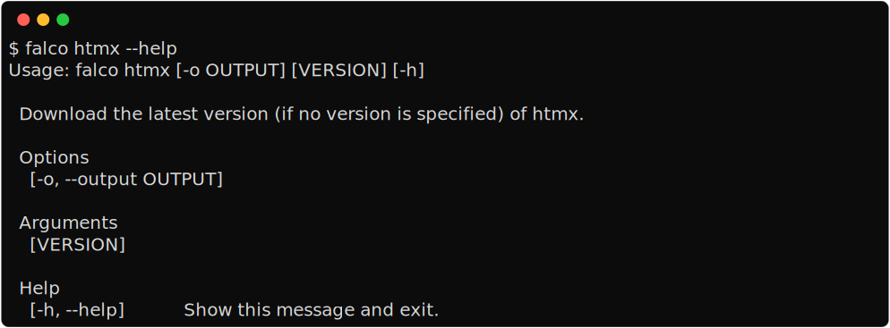

Running multiple process in parallel
====================================

This command allows you to run multiple commands simultaneously. Typically, when working with tailwind, you need to run
both the django ``runserver`` command and the tailwind ``compile`` command. This command uses the python package `honcho <https://github.com/nickstenning/honcho>`__ to
manage multiple processes. By default, it runs the django server, a redis server (if ``REDIS_URL`` is in your environment
or ``.env`` file), the tailwind compile and watch command if ``pytailwindcss`` is listed as a dependency in
your ``pyproject.toml`` file. It also runs the qcluster command from ``django-q2`` (if defined in your dependencies).
Additionally, if hupper is listed as a development dependency, it uses that to run the qcluster command..
You can specify the commands to run in the ``[tool.falco]`` section using the ``work`` key. If
you define a command with the same name as the default, it will override it. Here are the default commands:

.. code:: toml

   [tool.falco.work]
   server = "python manage.py runserver"
   tailwind = "tailwindcss -i project_name/static/css/input.css -o project_name/static/css/output.css --watch"
   redis = "redis-server"
   worker = "python manage.py qcluster"
  
